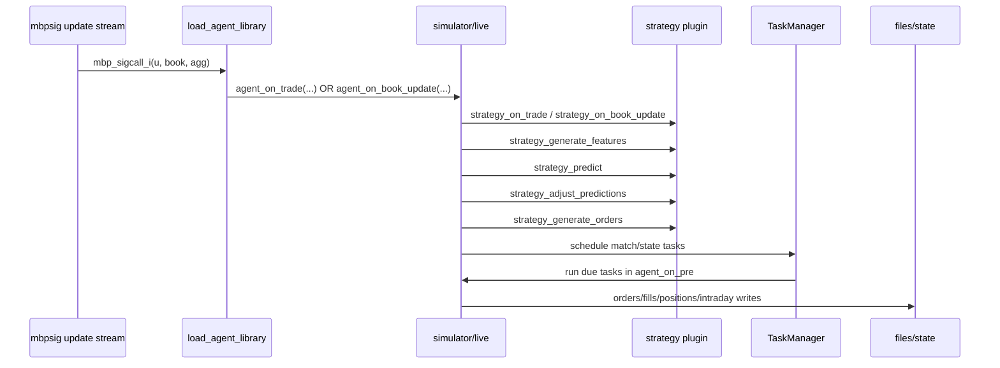

# Modular Equities Trading Engine (Legacy Snapshot)

This repository contains a C-based, plugin-oriented equities trading stack with three runtime agent modes:

- `sampler`: generate labeled training samples from market data.
- `simulator`: backtest order generation and matching against historical books.
- `live`: run the same strategy interfaces in live mode (order sending is currently a stub).

The code is organized around a shared strategy ABI, common market/trading utilities, and a LightGBM-style MART model loader.

## Current State (Important)

This repo appears to be a **partially flattened / partially migrated snapshot**. A few paths and build files are inconsistent with source includes and expected layout.

| Area | Observed state |
|---|---|
| Build entrypoint | `src/CMakeLists.txt` exists, but `add_subdirectory(src/...)` paths are relative to `src/` and fail in current tree. |
| Submodule CMake files | Only 4 CMake files exist: `src/CMakeLists.txt`, `src/common/CMakeLists.txt`, `src/strategy/momentum_sieve/CMakeLists.txt`, `src/adjust_predictions/CMakeLists.txt`. |
| Embedded fragments | `src/common/CMakeLists.txt` and `src/strategy/momentum_sieve/CMakeLists.txt` contain concatenated fragments that look like other missing CMake files. |
| Header naming | `include/mrtl/strategy/fuction_signatures.h` has a typo in filename (`fuction`). Some code includes `function_signatures.h`. |
| Header mismatch | `include/mrtl/common/log_record.h` defines lag-record APIs, but code includes `mrtl/common/lag_record.h`. |
| Missing include trees | Several includes reference paths under `include/mrtl/agent/...` and `include/mrtl/model/...`, but actual files are in `agent/` and `model/`. |
| Live order routing | `live_client_send_order()` is a TODO stub. |

The file `mrtl.txt` appears to be a historical dump of expected paths/content and helps explain the mismatch.

## High-Level Architecture

```mermaid
graph TD
    MBP[Market Data Feed / mbpsig callbacks]
    LOADER[load_agent_library.c\nmbp_sigalloc_i / mbp_sigcall_i]
    AGENT[sampler | simulator | live]
    STRATLIB[Strategy .so\nclassic | momentum_sieve]
    COMMON[mrtl_common\n(types, tasks, country, db loaders)]
    MART[MART model runtime\n(LightGBM text parser)]
    DB[(cfgdb/sidb + hfstock/equitydata DB)]
    OUT[(output files)]

    MBP --> LOADER
    LOADER --> AGENT
    AGENT --> STRATLIB
    AGENT --> COMMON
    STRATLIB --> COMMON
    STRATLIB --> MART
    COMMON --> DB
    AGENT --> OUT
```

## Runtime Modes

| Agent library | Purpose | Uses strategy functions | Primary outputs |
|---|---|---|---|
| `src/agent/sampler.c` | Build supervised training dataset | `init`, `init_symbol_datas`, `on_trade`, `on_book_update`, `generate_features`, `calculate_target`, `write_sample_header` | `samples_<COUNTRY>_set<SET>_<DT>.txt` |
| `src/agent/simulator.c` | Backtest order generation + matching + PnL tracking | `init`, `predict`, `adjust_predictions`, `init_symbol_datas`, `on_trade`, `on_book_update`, `generate_features`, `generate_orders` | `*_orders_*`, `*_fills_*`, `*_positions_*`, `*_intraday_*` |
| `src/agent/live.c` | Live execution path with same core callbacks | Same as simulator | `*_positions_*` (order send path currently stubbed) |

## Core Event Flow (Simulator/Live)



## Module Map

| Path | Responsibility |
|---|---|
| `src/agent/load_agent_library.c` | Top-level runtime loader used by mbpsig callbacks. Loads agent `.so` from config and dispatches updates. |
| `src/agent/load_strategy_library.c` | Loads required strategy symbols via `dlsym`. |
| `src/agent/sampler.c` | Sampling pipeline, midprice timeline tasks, transient filtering, target generation at finalize. |
| `src/agent/simulator.c` | Backtest trading loop, order scheduling, simulated matching, fill accounting, periodic state writes. |
| `src/agent/live.c` | Live trading loop; similar logic to simulator without matching engine. |
| `src/common/types.c` | Core trading structs behavior: order/fill/accounting updates and serialization. |
| `src/common/task.c` | RB-tree-based task scheduler used by sampler/simulator. |
| `src/common/functions.c` | Math helpers + DB access loaders (`stockcharacteristics`, order params, market-making params, positions). |
| `src/common/country.c` | Session windows, lunch handling, date validity checks, previous trading day query. |
| `src/common/moving_averages.c` | Time-weighted moving average and leaky accumulator primitives. |
| `src/common/ring_buffer.c`, `src/common/log_record.c` | Lag-record data structure for time-lagged signals. |
| `src/strategy/classic/*` | Multi-horizon strategy with large feature set, hedged targets, market-taking + partial market-making scaffolding. |
| `src/strategy/momentum_sieve/*` | Simpler momentum strategy with 1 horizon, breakout/retreat target, market-taking order logic. |
| `src/model/mart/mart.c` | LightGBM text model parser and tree ensemble inference. |

## Strategy Plugin ABI

The runtime expects strategy plugins to export these symbol names.

| Function | Required by | Role |
|---|---|---|
| `strategy_init` | all agents | Load strategy config and (optionally) models. |
| `strategy_init_symbol_datas` | all agents | Allocate per-symbol strategy state and map into `SymbolData`. |
| `strategy_on_trade` | all agents | Update per-symbol state on trade events. |
| `strategy_on_book_update` | all agents | Update per-symbol state on book updates. |
| `strategy_generate_features` | sampler/simulator/live | Produce model inputs. |
| `strategy_predict` | simulator/live | Infer predictions from MART models. |
| `strategy_adjust_predictions` | simulator/live | Apply risk/restoring-force adjustments. |
| `strategy_generate_orders` | simulator/live | Emit orders from prediction + state. |
| `strategy_calculate_target` | sampler | Build supervised targets after sampling. |
| `strategy_write_sample_header` | sampler | CSV header for sample file. |

## Data Model Highlights

| Struct | Purpose |
|---|---|
| `BBO` | Top-of-book bid/ask pair used throughout feature and accounting paths. |
| `Sample` | Training row: NBBO snapshot + feature vector + target vector. |
| `Predictions` | Strategy prediction payload (`pred[]`, restoring force, risk adjustments). |
| `Order` / `Fill` | Order intent and realized execution records. |
| `SymbolTradingData` | Thread-safe per-symbol position/order/trade accounting. |
| `GlobalTradingData` | Thread-safe portfolio-level exposure/cash/notional tracking. |
| `SymbolData` | Strategy-agnostic symbol shell linking trading data + strategy data. |

## Configuration Surface

All runtime config is read via `iniparser` from `MRTL_AGENT_CONFIG`.

### Environment variables

| Variable | Purpose |
|---|---|
| `MRTL_AGENT_CONFIG` | Path to INI config consumed by loader and agents. |
| `DT` | Trade date as integer `YYYYMMDD`. |

### Common INI keys

| Section:key | Used by |
|---|---|
| `agent:library` | loader (dynamic load of sampler/simulator/live agent `.so`) |
| `agent:log_severity` | loader |
| `agent:use_dark_trades` | loader |
| `strategy:library` | sampler/simulator/live (strategy plugin `.so`) |
| `agent:output_directory` | sampler/simulator/live |
| `agent:do_cycle_sampling`, `agent:do_trade_sampling`, `agent:do_nbbo_sampling` | sampler |
| `agent:cycle_sample_period_seconds`, `agent:midprice_sample_period_seconds`, `agent:transient_cutoff_milliseconds` | sampler |
| `agent:do_cycle_trading`, `agent:do_trade_trading`, `agent:do_nbbo_trading` | simulator/live |
| `agent:exchange_latency_milliseconds` | simulator |
| `agent:open_wait_seconds`, `agent:max_notional_position` | simulator/live |
| `country:*` (`name`, `open_time_hours`, `close_time_hours`, lunch windows, db host/name, exchange_count) | all agents via `country_init` |

### Strategy-specific keys

| Strategy | Keys |
|---|---|
| `momentum_sieve` | `strategy:horizon_seconds`, `strategy:trade_model_file`, `strategy:cycle_model_file`, `strategy:order_cooldown_seconds`, restoring-force factors |
| `classic` | `strategy:horizon{1..4}_{from,to}_seconds`, `strategy:om_cycle_model_file`, `strategy:om_trade_model_file`, `strategy:tm_cycle_model_file` |

## Output Files

| Agent | Filename pattern |
|---|---|
| sampler | `<output_dir>/samples_<COUNTRY>_set<SET>_<DT>.txt` |
| simulator | `<output_dir>/<COUNTRY>_orders_set<SET>_<DT>.txt` |
| simulator | `<output_dir>/<COUNTRY>_fills_set<SET>_<DT>.txt` |
| simulator | `<output_dir>/<COUNTRY>_positions_set<SET>_<DT>.txt` |
| simulator | `<output_dir>/<COUNTRY>_intraday_set<SET>_<DT>.txt` |
| live | `<output_dir>/<COUNTRY>_positions_set<SET>_<DT>.txt` |

## Repository Tree (Current)

```text
.
├── agent/                         # agent headers (not under include/)
├── include/mrtl/common/           # common public headers
├── include/mrtl/strategy/classic/ # classic strategy headers
├── include/strategy/momentum_sieve/config.h
├── model/mart/mart.h              # model header (not under include/)
├── src/
│   ├── agent/                     # sampler/simulator/live/loader implementations
│   ├── common/                    # shared utilities
│   ├── strategy/
│   │   ├── classic/
│   │   └── momentum_sieve/
│   ├── model/mart/
│   └── adjust_predictions/
└── mrtl.txt                       # archival dump of expected file layout/content
```

## Build Notes

The current tree does not configure cleanly out of the box due path inconsistencies:

- `src/CMakeLists.txt` uses `add_subdirectory(src/...)` even though it is already inside `src/`.
- Several expected CMake files/headers are embedded as text fragments rather than present as standalone files.

A restore/cleanup pass is needed before reliable builds:

1. Normalize include/header paths (`agent/`, `model/`, `function_signatures`, `lag_record` naming).
2. Split concatenated CMake/header fragments into real files.
3. Fix CMake subdirectory paths.
4. Re-run CMake and address external dependency linkage (`cfgdb`, `dbw`, `sidb`, `mbpsig`, `mlog`, etc.).

## Implementation Gaps / TODOs Worth Tracking

| Area | Gap |
|---|---|
| Live execution | `live_client_send_order()` is stubbed. |
| Simulator/Live | Several TODOs around global state update cadence and order gating conditions on book-update events. |
| Common loaders | `filter_corporate_action_symbols()` is TODO/no-op. |
| Params loading | Validation stubs (`if(true)`) in `load_order_params` / `load_market_making_params`. |
| Strategy classic | Market-making path is partially implemented/scaffolded. |
| Strategy model loading | `classic/init.c` appears to load multiple model files into the same model slot (`models[0]`). |

---

If you want, the next step can be a cleanup PR that restores buildability (CMake + include path normalization) while keeping behavior unchanged.
